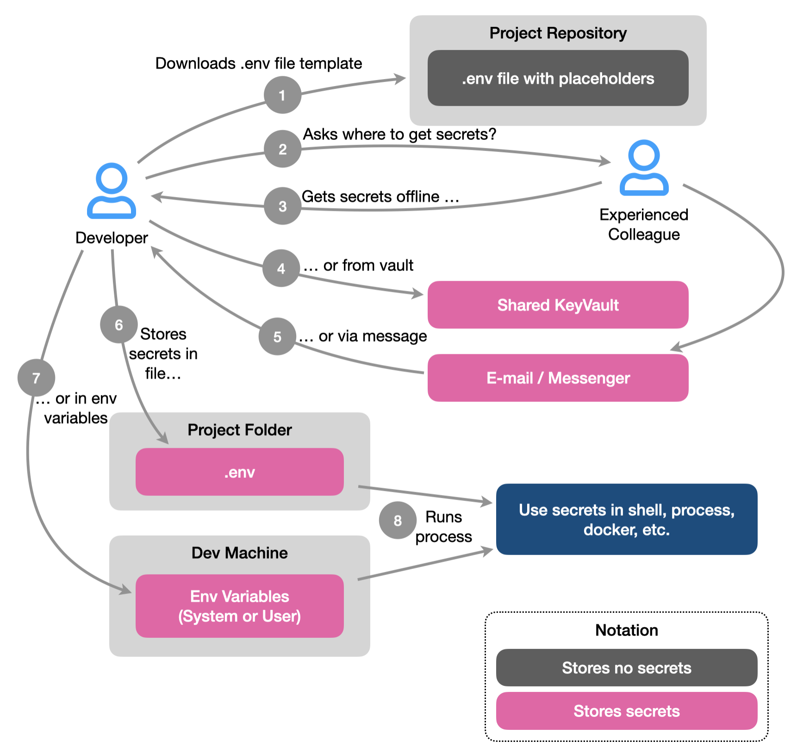
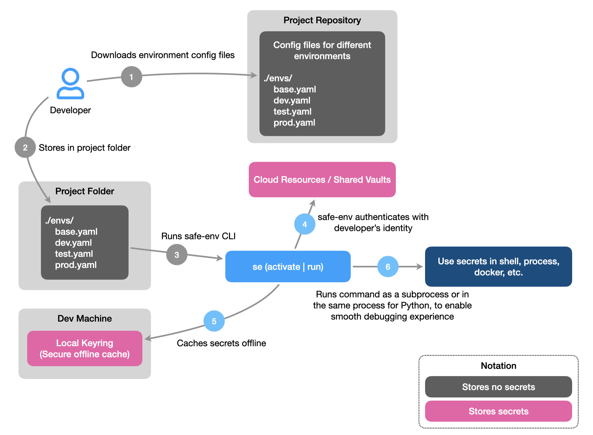
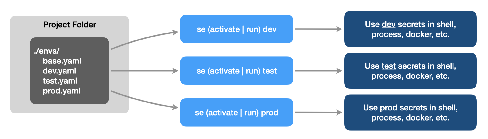

# Welcome to Safe Environment Manager (safe-env)
*Safe Environment Manager* allows to manage secrets in environment variables in a safe way.
To achieve this, safe-env follows a set of principles:

1. Configurations for different environments are stored in a set of yaml files, that have no secrets and can be safely pushed to git repository.
0. Secrets are never written to local files, even temporarily (Note: also it is possible to save the output in the file, this is not recommended, and should be considered only as an exception for short term temporary use).
0. Secrets are stored in one of the following safe locations:
    - the resource itself (for example, access key in Azure Storage Account configuration);
    - external vault (for example, Azure KeyVault);
    - local keyring;
    - environment variables (in memory).
0. Access to required resources and vaults is controlled via standard user authentication mechanisms (for example, `az login` or interactive browser login for Azure).

When developer is on-boarding to a new project, that uses regular .env files, the process usually looks like this:

{ width="500" }
/// caption
Developing without safe-env
///

There are many steps involved, and a lot of opportunities for secrets to leak along the way. In addition, the secrets end up in unsecure places - local .env file in project folder, or environment variables on development machine.

Secrets from .env file can leak in many different ways:

- Building project package with wrong settings.
- Pushing code to git with wrong .gitignore.
- Archiving project folder and sending to someone.
- Using Generative AI tool that is crawling all files in the project or all files opened in IDE.
- Copying project folder into unencrypted backup.
- Sharing machine with other users.

Secrets from system/user environment variables are accessible to all processes, and can also leak - for example, because of incorrect logging configuration, or verbose dump of process state, that includes environment variables.

**safe-env** helps to simplify on-boarding process, and ensure that secrets are stored only in-memory or in secure storage.

{ width="600" }
/// caption
Developing with safe-env
///

This also allows to quickly switch between environments while developing, testing, or using software.

{ width="600" }
/// caption
Switching environments with safe-env
///

Let's [get started](getting-started.md)!